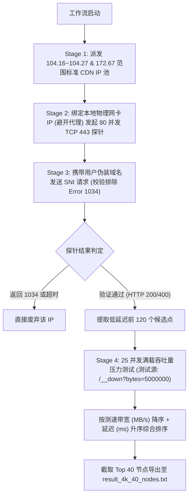

# Cloudflare 优选 IP 实战经验与技术指南

本指南总结了在开发与实战使用 `CFData-WEB` (`cfdata.exe`) 及 Cloudflare 优选 IP 过程中的核心原理、实操步骤、踩坑经验（如代理干扰、Cloudflare Error 1034 限制）、YouTube 4K 节点筛选工作流以及完整的客户端配置排查清单。

---

## 1. 核心原理与机制

### 1.1 为什么需要 Cloudflare 优选 IP？
Cloudflare 拥有全球数百个数据中心和成千上万个 Anycast IP 地址。国内三大运营商（中国电信、中国联通、中国移动）在不同地区、不同时间段访问 Cloudflare 的不同 IP 段时，路由路径和阻塞情况存在巨大差异：
* **默认 DNS 解析**：往往会将请求分配到高延迟或丢包严重的节点（如跨越太平洋绕道美西）。
* **优选 IP 机制**：通过在本地对 Cloudflare 全量 IP 库进行直连延迟与下载测速，筛选出当前网络下**延迟最低、零丢包、速度最快**的特定 IP，并在客户端中替代默认解析 IP，从而实现数倍的网络提速。

---

## 2. 利用 `cfdata` 进行优选的具体实操步骤

### 2.1 准备工作 (前置必备)
1. **彻底关闭本地代理软件**：关闭 Clash、v2rayN、Sing-box、VPN 等代理软件，**特别是退出 TUN/虚拟网卡模式**，确保电脑处于本地运营商纯直连状态。
2. **下载/准备 `cfdata.exe`**：确保 `cfdata.exe` 与配置文件 `cfdata-config.json`、`ips-v4.txt` 在同一目录下。

---

### 2.2 方法一：WEB 界面操作 (图形化操作)

1. **启动服务**：在终端双击运行 `.\cfdata.exe`，程序会自动启动 Web 服务器并在浏览器中打开 `http://localhost:8080`（或 `http://127.0.0.1:8080`）。
2. **选择测速模式**：
   * 在控制面板顶部选择 **官方模式** (Official Mode)。
3. **参数配置**：
   * **端口 (Port)**：保持默认 `443`。
   * **数据中心 (DC)**：如果想限制指定地区，在输入框中填入数据中心三字码（例如 `SIN` 新加坡、`NRT` 东京、`LAX` 洛杉矶、`FRA` 法兰克福）；留空则全自动选取全局最快。
   * **测速线程数**：可设置并发下载测试线程（如 `5`）。
4. **开始测试**：点击“**开始测试**”按钮，观察页面实时的延迟扫描进度条与测速结果表格。
5. **导出结果**：测试完成后，点击右上角“**导出 TXT / CSV**”按钮保存优选好的 IP 列表。

---

### 2.3 方法二：CLI 命令行模式 (高效自动化操作)

`cfdata.exe` 提供了强大的 CLI 命令行选项，适合一键脚本或自动化运行。

#### 常用 CLI 优选命令案例：

* **案例 1：快速获取全局最优 IP（标准模式）**
  ```powershell
  .\cfdata.exe -cli -skipgeo -mode official -offiptype 4 -offport 443 -format txt -offout result_top.txt
  ```

* **案例 2：指定生成某个特定地区的优选 IP（例如日本东京 NRT）**
  ```powershell
  .\cfdata.exe -cli -skipgeo -mode official -offiptype 4 -offport 443 -offdc NRT -offspeedmin 0.1 -format txt -offout result_nrt.txt
  ```

* **案例 3：仅扫描延迟不测速度（适合快速扫描多数据中心全量节点）**
  ```powershell
  .\cfdata.exe -cli -skipgeo -mode official -offiptype 4 -offport 443 -offspeedlimit 0 -format csv -fields ipport,latency,dc,region,city -offout all_scanned.csv
  ```

---

## 3. YouTube 4K 播放标准节点筛选工作流

为了筛选出**可以稳定秒开 4K 视频**的精选 40 节点，工作流设计了四阶段严苛探针：



关于该工作流的完整 Python 自动化代码实现，请参见专门的流程文档：[YOUTUBE_4K_WORKFLOW.md](file:///d:/WorkSpacePersonal/cfdata/YOUTUBE_4K_WORKFLOW.md)。

---

## 4. 核心踩坑经验总结与解决方案

### ❌ 踩坑一：本地代理/VPN 软件干扰测试结果
* **问题现象**：
  在运行优选程序时，测试结果非常优秀（如 10 MB/s 下载速度、低延迟），但把筛选出的 IP 填入客户端去直连时，却发现完全连不上或严重丢包。
* **根源分析**：
  * 测试时本地开启了代理软件（特别是开了 **TUN 虚拟网卡模式** 或 **系统代理**）。
  * 测速程序发出的探针请求被系统路由强制重定向到了代理通道中。
  * **所测出的“高网速/低延迟”，实际上是代理服务器的性能，而非本地直连 Cloudflare 的性能**。大量被 GFW 阻断的死 IP 在代理中转下会呈现假健康。
* **解决方案**：
  1. **物理网卡 Socket 绑定**：在测速代码中强制将 TCP Socket 绑定到本地真实的物理网卡 IP（如 `s.bind((PHY_IP, 0))`），强行绕过 TUN/代理网卡。
  2. **直连断言校验**：请求 Cloudflare `/cdn-cgi/trace` 接口，校验返回的 `loc` 标签（国内直连必为 `loc=CN`）。

---

### ❌ 踩坑二：Cloudflare Error 1034 (Edge IP Restricted / 跨账号 IP 绑定限制)
* **问题现象**：
  在 v2rayN 中对优选 IP 进行 TCP 端口 443 连通性测试显示正常，但在右键菜单中测试“**真连接延迟**”时，却全部返回 `-1`（超时）。
* **根源分析**：
  * Cloudflare 防火墙推出了 **Error 1034** 保护机制，防止 IP 交叉解析/跨账号 SNI 伪造攻击。
  * 用户的域名如果托管在 Cloudflare 免费版/合作版（如标准 Zone `104.16.0.0/12` / `172.67.0.0/16`），连接到 `162.159.x.x` 或 `108.162.x.x`（WARP/企业级 IP 段）并携带该域名作为 Host 时，Cloudflare 边缘节点会直接返回 `403 Forbidden (Error 1034: Edge IP Restricted)`。
  * 由于 HTTP 握手在边缘被拦截，v2rayN 的 WebSocket 加密隧道无法建立，故真连接测试报 `-1`。
* **解决方案**：
  * **IP 池匹配**：优选程序必须针对目标域名的解析池范围（如 `104.16.x.x` ~ `104.27.x.x` 及 `172.67.x.x`）进行探针匹配。
  * **域名契合度检测**：在优选探针中，携带用户的真实伪装域名发送 HTTP/HTTPS 请求，排除所有返回 `Error 1034` 的 IP 段。

---

## 5. 客户端 (v2rayN / Clash) 排查清单

当节点在客户端中连不上或真连接显示 `-1` 时，按以下顺序排查：

| 排查项 | 正确配置要求 | 说明与常见错误 |
| :--- | :--- | :--- |
| **Address (地址)** | `104.18.36.2` | 填写优选出的 Cloudflare 节点 IP |
| **Host (伪装域名)** | `your-domain.com` | **严禁留空/填 IP**！必须填写你在 Cloudflare 上套了 CDN 的个人域名 |
| **SNI (ServerName)** | `your-domain.com` | 与 Host 保持一致（开启 TLS 时） |
| **Network (传输协议)** | `ws` 或 `grpc` | 免费版 Cloudflare **仅支持** WebSocket 或 gRPC，不支持纯 `tcp` |
| **Path (伪装路径)** | `/vmess` 或 `/vless` | 必须与你 VPS 服务端的 Path 完全一致 |
| **TLS (传输安全)** | 开启 (`tls`) | 使用 443 / 8443 等 TLS 端口时必须开启 |
| **Cloudflare CDN 状态** | 开启小黄云 (Proxied) | 域名在 Cloudflare DNS 页面必须点亮小黄云，不可为灰云 (DNS Only) |

---

## 6. 总结

搞定 Cloudflare 优选 IP 的三大金律：
1. **排除代理干扰**：必须在无代理/物理网卡直连下测试，确保数据真实。
2. **规避 Error 1034**：探针阶段必须使用最终域名做 SNI/Host 校验，剔除越权 IP。
3. **正确对齐客户端**：`Address` 填优选 IP，`Host/SNI` 填绑定的域名，协议必须走 `ws/grpc`。
